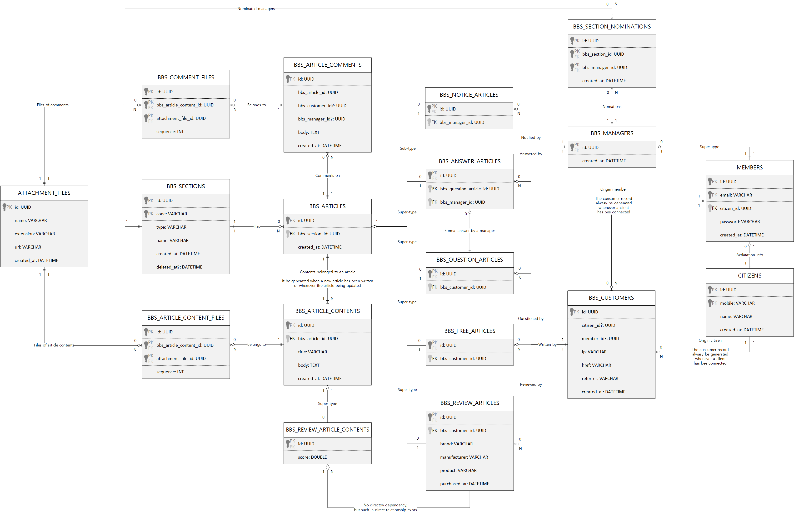

# Backend
> 한국어 브랜치: [samchon/backend/tree/korean](https://github.com/samchon/backend/tree/korean)

## 1. Outline
### 1.1. Introduction
[](https://github.com/samchon/backend/actions?query=workflow%3Abuild)

A template repository for the Typescript Backend Server using those libraries:

  - [NestJS](https://nestjs.com) and [**`nestia`**](https://github.com/samchon/nestia): Automatic client SDK generator for NestJS
  - [TypeORM](https://typeorm.io) and [**`safe-typeorm`**](https://github.com/samchon/safe-typeorm): Helper of TypeORM in the compilation level

Also, I've prepared lots of example backend projects based on this template project. Reading this [README.md](https://github.com/samchon/backend) document and traveling below example projects, you may understand how to develop the TypeScript backend server with the [nestia](https://github.com/samchon/nestia) and [safe-typeorm](https://github.com/samchon/safe-typeorm).

  - [samchon/bbs-backend](https://github.com/samchon/bbs-backend): Built-in Board System
  - [archidraw/payments](https://github.com/archidraw/payments): Integrated Payments Server using multiple PGs.
    - [samchon/fake-iamport-server](https://github.com/samchon/fake-iamport-server): Fake iamport server, but real SDK
    - [samchon/fake-toss-payments-server](https://github.com/samchon/fake-toss-payments-server): Fake toss-payments server, but real SDK
  - academic-backend: preparing...
  - delivery-backend: preparing...


If you wanna new type of example backend project or you've something to ask me about the TypeScript backend server development, don't mine anything and just write an issue for help. I or another developers interested in this project will support you.

Also, if you've developed a TypeScript backend server and it seems like that its quality is enough good to be a good example for the backend programming learners, please write an issue or send a pull request about the project.

### 1.2. Specializations
Transform this template project to be yours.

When you've created a new backend project through this template project, you can specialize it to be suitable for you by changing some words. Replace below words through IDE specific function like `Edit > Replace in Files` (*Ctrl + Shift + H*), who've been supported by the VSCode.

| Before          | After
|-----------------|----------------------------------------
| ${ORGANIZATION} | Your account or corporation name
| ${PROJECT}      | Your own project name
| ${AUTHOR}       | Author name
| test_db_schema  | Database schema to connnect
| https://github.com/samchon/backend | Your repository URL

After those replacements, you should specialize the [`src/Configuration.ts`](src/Configuration.ts), [.github/workflows/build.yml](.github/workflows/build.yml) files. Open those files and change constant values of these files to be suitable for your project. Also, open markdown files like this [README.md](README.md) and write your specific project story. Below is list of the markdown files.

  - [.github/ISSUE_TEMPLATE/BUG_REPORT.md](.github/ISSUE_TEMPLATE/BUG_REPORT.md)
  - [.github/ISSUE_TEMPLATE/FEATURE_REQUEST.md](.github/ISSUE_TEMPLATE/FEATURE_REQUEST.md)
  - [.github/ISSUE_TEMPLATE/QUESTION.md](.github/ISSUE_TEMPLATE/QUESTION.md)
  - [.github/PULL_REQUEST_TEMPLATE.md](.github/PULL_REQUEST_TEMPLATE.md)
  - [README.md](README.md)
  - [CODE_OF_CONNDUCT.md](CODE_OF_CONNDUCT.md)
  - [CONTRIBUTING.md](CONTRIBUTING.md)
  - [INTRASTRUCTURE.md](INTRASTRUCTURE.md)
  - [LICENSE](LICENSE)

### 1.3. Directories
This template project has categorized directories like below.

As you can see from the below, all of the TypeScript source files are placed into the [src](src/) directory. When you build the TypeScript source files, compiled files would be placed into the `bin` directory following the [tsconfig.json](tsconfig.json) configuration. Otherwise you build client [SDK](#32-sdk) library or ORM models for the private npm module publishing, their compiled files would be placed into the [packages](packages) directory.

If you want to customize configurations of the [Github Action](#52-github-action) or debugging who can be started by the pressing the `F5` key, edit the [.github/workflows/build.yml](.github/workflows/build.yml) or [.vscode/launch.json](.vscode/launch.json) file. Default of their configurations are using the [3.3. Test Automation Program](#33-test-automation-program) without any special argument.

When you're planning to deploy the backend server, read the [INFRASTRUCTURE.md](INFRASTRUCTURE.md) file and follow the steps. Following the steps, you may run some executable programs of the [src/executable](src/executable) directory.

  - [.github/workflows/build.yml](.github/workflows/build.yml): Configuration file of the [Github Action](#52-github-action)
  - [.vscode/launch.json](.vscode/launch.json): Configuration for debugging
  - [packages](packages/): Packages to publish as private npm modules
    - [packges/api](packages/api): Client [SDK](#32-sdk) library for the client developers
    - [packges/models](packages/models): ORM library for the DB developers
  - [src/](src/): TypeScript Source directory
    - [src/api/](src/api/): Client SDK that would be published to the `@${ORGANIZATION}/${PROJECT}-api`
      - [**src/api/functional/**](src/api/functional/): API functions generated by the [`nestia`](https://github.com/samchon/nestia)
      - [**src/api/structures/**](src/api/structures/): Data structures for the API functions
    - [src/controllers/](src/controllers/): Controller classes of the Main Program
    - [src/executable/](src/executable/): Executable programs
      - backend server itself
      - update program for the user
      - updator program in the server side
    - [src/models/](src/models/): ORM Models
    - [src/providers/](src/providers/): Conversion between ORM Model and API Structure
    - [**src/test/**](src/test/): Test Automation Program
  - [INFRASTRUCTURE.md](INFRASTRUCTURE.md): How to deploy the backend server on the cloud like AWS
  - [package.json](package.json): NPM configuration
  - [tsconfig.json](tsconfig.json): TypeScript configuration for the [Main Program](#34-main-program)
  - [tsconfig.api.json](tsconfig.api.json): TypeScript configuration for the client [SDK](#32-sdk)
  - [tsconfig.models.json](tsconfig.models.json): TypeScript configuration for the ORM Models package


## 2. Installation
### 2.1. NodeJS
This backend server has implemented through TypeScript and it runs on the NodeJS. Therefore, to mount this backend server on your local machine, you've to install the NodeJS.

  - https://nodejs.org/en/

Also as you can see from the [package.json](package.json) file, this project requires the private npm module `@${ORGANIZATION}`, provided from the Github. Therefore, to develop this backend server, you've configure the `.npmrc` file. Open the below link and complete the configuration.

  - https://github.com/features/packages

### 2.2. MariaDB
This backend server has adopted MariaDB as principle DB. Therefore, to mount this backend server on your local machine, you've to install the MariaDB. Click the below link, download and install the `MariaDB@10.5`.

  - https://downloads.mariadb.org/mariadb/10.5/

After the installation, open a terminal and configure account and password to be `root`.

> ```bash
> sudo mysqladmin -u root password 'root'
> ```

After the account configuration, connect to the MariaDB and create a new DB schema `test_db_schema`. Also, you should change the `sql_mode` options like below to enhance the strict grammer check for the safe development. 

For a representatively of such strict grammer checking for the safe development, the `ANSI` mode contains the `ONLY_FULL_GROUP_BY` condition. The `ONLY_FULL_GROUP_BY` option occurs a syntax error when non-aggregated field has been appeared in the `SELECT` statement who've not specialized in the `GROUP BY` statement.

```sql
-- CREATE A NEW SCHEMA
CREATE SCHEMA test_db_schema 
    DEFAULT CHARACTER SET utf8mb4 
    COLLATE utf8mb4_unicode_ci;

-- STRICT MODE
SET GLOBAL sql_mode = 'ANSI,TRADITIONAL';
```

### 2.3. Repository
From now on, you can start the backend server development, right now. 

Just download this project through the git clone command and install dependencies by the npm install command. After those preparations, you can start the development by typing the `npm run dev` command.

```bash
# CLONE REPOSITORY
git clone ${REPOSITORY}
cd backend

# INSTALL DEPENDENCIES
npm install

# START DEVELOPMENT (tsc --watch)
npm run dev
```

### 2.4. Data
When those installations have been all completed, you can mount the basic data up or start the local backend server by typing below commands.

At first, `npm run setup` is a command seed the initial data. Range of the initial data means that minimum data that is required for running the local backend server. Therefore, to mount the backend server up, you've to run the `npm run setup` command, at least.

At second, `npm run test` is a command running the test automation program. The test automation program not only seeds the initial data, but also generates sample data during the testing. Also, you've to know that, whenever run the `npm run test` command, the local DB would be reset. Therefore, you've consider it carefully, whenever calling the `npm run test` command.

```bash
# Seed initial data
# minimum data to running the local backend server
npm run setup 

# Run test automation program
# seed not only initial data, but also sample data
# it resets the local DB
npm run test 

# Start the local backend server
npm run start local 

# Stop the local backend server
npm run stop 
```


## 3. Development
### 3.1. Definition


If you want to add a new feature or update ordinary thing in the API level, you should write the code down to the matched *API controller*, who is stored in the [src/controllers](src/controllers) directory as the [Main Program](#34-main-program). 

However, [@samchon](https://github.com/samchon) does not recommend to writing code down into the [Main Program](#34-main-program) first, without any consideration. Instead, [@samchon](https://github.com/samchon) recommends to declare the definition first and implement the [Main Program](#34-main-program) later.

Therefore, if you want to add a new feature in the API level, define the matched data entity in the [src/models](src/models) and [src/api/structures](src/api/structures) directories. After the data entity definition, declare function header in the matched API controller class in the [src/controllers](src/controllers). Note that, it's only the declaration, header only, not meaning to implement the function body.

After those declarations, build the client [SDK](#32-sdk) through the `npm run build:api` command and implement the [Test Automation Program](#33-test-automation-program) using the [SDK](#32-sdk) with use case scenarios. Development of the [Main Program](#34-main-program) should be started after those preparations are all being ready. Of course, the [Main Program](#34-main-program) can be verified with the pre-developed [Test Automation Program](#33-test-automation-program) in everytime.

  - Declare data entity
  - Declare API function header
  - Build the client [SDK](32-sdk)
  - Implement the [Test Automation Program](#33-test-automation-program)
  - Develop the [Main Program](#34-main-program)
  - Validate the [Main Program](#34-main-program) through the [Test Automation Program](#33-test-automation-program)
  - Deploy to the Dev and Real servers.

### 3.2. SDK
[`@${ORGANIZATION}/${PROJECT}`](https://github.com/samchon/backend) provides SDK (Software Development Kit) for convenience.

For the client developers who are connecting to this backend server, [`@${ORGANIZATION}/${PROJECT}`](https://github.com/samchon/backend) provides not API documents like the Swagger, but provides the API interaction library, one of the typical SDK (Software Development Kit) for the convenience.

With the SDK, client developers never need to re-define the duplicated API interfaces. Just utilize the provided interfaces and asynchronous functions defined in the SDK. It would be much convenient than any other Rest API solutions.

To build the SDK, just type the `npm run build:api` command. The SDK would be generated by [`nestia`](https://github.com/samchon/nestia), by analyzing source code of the [controller](src/controllers) classes in the compilation level, automatically. After the SDK building, you can publish the SDK through the `npm run package:api` command.

```bash
# BUILD SDK AND PUBLISH IT
npm run build:api
npm run package:api
```

When the SDK has been published, client programmers can interact with this backend server very easily. Just let them to install the SDK and call the SDK functions with the `await` symbol like below.

```typescript
import api from "@samchon/bbs-api";

import { IBbsCitizen } from "@samchon/bbs-api/lib/structures/bbs/actors/IBbsCitizen";
import { IBbsQuestionArticle } from "@samchon/bbs-api/lib/structures/bbs/articles/IBbsQuestionArticle";
import { IBbsSection } from "@samchon/bbs-api/lib/api/structures/bbs/systematic/IBbsSection";

async function main(): Promise<void>
{
    //----
    // PREPARATIONS
    //----
    // CONNECTION INFO
    const connection: api.IConnection = {
        host: "http://127.0.0.1:37001",
        password: {
            key: "pJXhbHlYfzkC1CBK8R67faaBgJWB9Myu",
            iv: "IXJBt4MflFxvxKkn"
        }
    };

    // ISSUE A CUSTOMER ACCOUNT
    const customer: IBbsCustomer = await api.functional.bbs.customers.authenticate.issue
    (
        connection,
        {
            href: window.location.href,
            referrer: window.document.referrer
        }
    );

    // ACTIVATE THE CUSTOMER
    customer.citizen = await api.functional.bbs.customers.authenticate.activate
    (
        connection,
        {
            name: "Jeongho Nam",
            mobile: "821036270016"
        }
    );

    //----
    // WRITE A QUESTION ARTICLE
    //----
    // FIND TARGET SECTION
    const sectionList: IBbsSection[] = await api.functional.bbs.customers.systematic.sections.index
    (
        connection
    );
    const section: IBbsSection = sectionList.find(section => section.type === "qna")!;

    // PREPARE INPUT DATA
    const input: IBbsQuestionArticle.IStore = {
        title: "Some Question Title",
        body: "Some Question Body Content...",
        files: []
    };

    // DO WRITE
    const question: IBbsQuestionArticle = await api.functional.bbs.customers.articles.qna.store
    (
        connection, 
        section.code,
        input
    );
    console.log(question);
}
```

### 3.3. Test Automation Program
> TDD (Test Driven Development)

After the [Definition](#31-definition) and client [SDK](#32-sdk) generation, you've to design the use-case scenario and implement a test automation program who represents the use-case scenario and guarantees the [Main Program](#34-main-program).

To add a new test function in the Test Automation Program, create a new TS file under the [src/test/features](src/test/features) directory following the below category and implement the test scenario function with representative function name and `export` symbol. I think many all of the ordinary files wrote in the [src/test/features](src/test/features) directory would be good sample for you. Therefore, I will not describe how the make the test function detaily.

  - [src/test/features/api](src/test/features/api)
    - About the cllient [SDK](#32-sdk) that would be provided to the frontend developers,
    - Validate the matched API implemented in the [Main Program](#34-main-program)
    - Use all of the API functions, through lots of scenarios
    - Most of the test functions are belonged to this category
  - [src/test/features/models](src/test/features/models)
    - About the ORM Model classes
    - Validate tables, methods, and even materialized views
    - through lots of scenarios
  - [src/test/features/external](src/test/features/external)
    - Open virtual external systems
    - Validate interactions with this backend server

Anyway, you've to remind that, the Test Automation Program resets the DB schema whenever being run. Therefore, you've to be careful if import data has been stored in the local (or dev) DB server. To avoid the resetting the DB, configure the `skipReset` option like below.

Also, the Test Automation Program runs all of the test functions placed into the [src/test/features](src/test/features) directory. However, those full testing may consume too much time. Therefore, if you want to reduce the testing time by specializing some test functions, use the `include` option like below.

  - supported options
    - `mode`: mode of the target server
      - *local*
      - *dev*
      - ~~*real*~~
    - `include`: test only restricted functions who is containing the special keyword.
    - `exclude`: exclude some functions who is containing the special keyword.
    - `skipReset`: do not reset the DB
    - `count`: repeating count of the test automation program.

```bash
# test in the dev server
npm run test -- --mode=dev

# test without db reset
npm run test -- --skipReset

# test only restricted functions whose name contain the "something" keyword
# do not reset db
npm run test -- --include=something --skipReset
```

### 3.4. Main Program
After [Definition](#31-definition), client [SDK](#32-sdk) building and [Test Automation Program](#33-test-automation-program) are all prepared, finally you can develop the Main Program. Also, when you complete the Main Program implementation, it would better to validate the implementation through the pre-built [SDK](#32-sdk) and [Test Automation Program](#33-test-automation-program).

However, do not commit a mistake that writing source codes only in the [controller](src/controllers) classes. The API Controller must have a role that only intermediation. The main source code should be write down separately following the directory categorizing. For example, source code about DB I/O should be written into the [src/providers](src/providers) directory.


## 4. Deploy
### 4.1. Non-distruptive Update System
If you committed a new version and pushed it into the repository, you can update the backend server without any distruption. By the `npm run update` command, you can let backend server to act those non-distruptive update processes.

  - Pull new commit
  - Build the new soure code
  - Restart the backend server without distruption

To accomplish the non-distruptive update system, the server instance must run the updator program before mounting the backend server program up. If the target backend system is composed with multiple server instances like ELB (Elastic Load Balancer) and target instance is not a type of the master instance, you should write the `npm run start:updator:slave` command. 

Otherwise, use the `npm run start:updator:master` command.

```bash
#----
# RUN UPDATOR PROGRAM
#----
# THE INSTANCE IS MASTER
npm run start:updator:master

# THE INSTANCE IS SLAVE
npm run start:updator:slave

#----
# MOUNT THE BACKEND SERVER UP
#----
npm run start real
```

### 4.2. Local Server
Sometimes, you may desire to mount the backend server on your local system, not for running the [Test Automation Program](#33-test-automation-program), but for other reason like the *Front-end Application Development*. 

In that case, you can mount the local backend server up and let it to keep the opening status, until the `npm run stop` command be executed, by typing the `npm run start local` command.

```bash
npm run start local
npm run stop
```

Also, if someone else committed a new version into the master branch, you can update your local backend server without distruption. It means that, [non-distruptive update system](#41-non-distruptive-update-system) even works in the local environment. To activate the [non-distruptive update system](#41-non-distruptive-update-system), run the updator program before mounting the backend server up on your local machine.

```bash
# START THE LOCAL BACKEND SERVER WITH UPDATOR PROGRAM
npm run start updator:master
npm run start local

# UPDATE THE LOCAL SERVER WITHOUT DISTRUPTION
npm run update local
```

### 4.3. Dev Server
To update the dev server is very easy. Just commit a new code into the `dev` branch, and type the `npm run update dev` command on your local machine. By the command, the dev server will replace its code to the latest and the [Non-distruptive Update System](#41-non-distruptive-update-system) would be executed.

```bash
npm run update dev
```

Also, the dev server is designed to test and validate the newly commited source code before releasing to the [Real Server](#44-real-server). Therefore, even dev server may required to reset its DB like the [Local Server](#42-local-server) who oftens run the [Test Automation Program](#33-test-automation-program).

```bash
# MOVE TO THE PROJECT DIRECTORY
ssh ${dev_address}
cd ${project_directory}

# DO RESET
npm run reset:dev

# REFERENCE - COMMAND SET COMPOSING THE RESET:DEV
git pull
npm install
npm run build
npx pm2 delete all
npm run test -- --mode=dev
npm run start:updator:master
npm run start dev
```

### 4.4. Real Server
To update the real server is very easy. Just commit a new code into the `real` branch, and type the `npm run update real` command on your local machine. By the command, the dev server will replace its code to the latest and the [Non-distruptive Update System](#41-non-distruptive-update-system) would be executed.

```bash
npm run update real
```


## 5. Appendix
### 5.1. NPM Run Commands
List of the run commands defined in the [package.json](package.json) are like below:

  - `build`: Compile the source code
    - `build:api`: Build client SDK libray for the client developers
    - `build:models`: Build ORM library
  - `dev`: Incremental compilation using the `--watch` option
  - `reset:dev`: Restart the dev backend server with DB reset
  - `start`: Start the backend server
    - `npm run start local`
    - `npm run start dev`
    - `npm run start real`
  - `package:api`: Deploy the client SDK library
  - `package:models`: Deploy the ORM library
  - `start:updator:master`: Start non-distruptive update system (master)
  - `start:updator:slave`: Start non-distruptive update system (slave)
  - `start:reload`: Restart the backend server
  - `stop`: Stop the backend server
  - `stop:updator:master`: Stop non-distruptive update system (master)
  - `stop:updator:salve`: Stop non-distruptive update system (slave)
  - `test`: Start the [Test Automation Program](#33-test-automation-program)
  - `test:update`: Test the non-distruptive update system
  - `update`: Start the non-distruptive update
    - npm run update dev
    - npm run update real

### 5.2. Github Action
[](https://github.com/samchon/backend/actions?query=workflow%3Abuild)

This backend project utilizes the Github Action to run the cloud CI (Continuous Integration) test whenever a commit or PR event occurs. The CI test starts from installing the backend server program to a clean Ubuntu system that nothing has been installed yet.

You know what? All of CI processes, like installing required programs into the clean Ubuntu and compiling and running the Test Automation Program, are defined in the [`.github/workflows/build.yml`](.github/workflows/build.yml) script file. Also <font color="green">passing</font> or <font color="red">failure</font> expressed from the above [badge](https://github.com/samchon/backend/actions?query=workflow%3Abuild) represents outcome of the CI test.

### 5.3. Related Repositories
> Write the related repositories down.