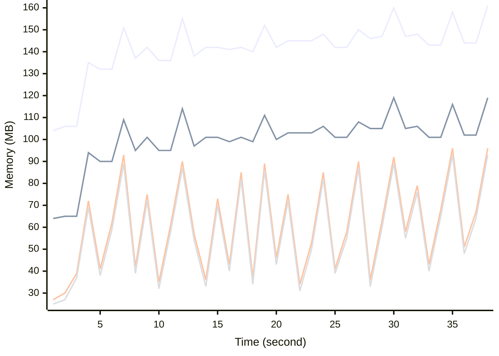

# Benchmark Report
> Generated by [`@nestia/benchmark`](https://github.com/samchon/nestia)

  - Specifications
    - CPU: AMD Ryzen 9 7940HS w/ Radeon 780M Graphics     
    - RAM: 31 GB
    - NodeJS Version: v20.10.0
    - Backend Server: 1 core / 1 thread
  - Arguments
    - Count: 80,000
    - Threads: 4
    - Simultaneous: 32
  - Time
    - Start: 2024-07-26T17:42:01.478Z
    - Complete: 2024-07-26T17:42:40.396Z
    - Elapsed: 38,918 ms

Type | Count | Success | Mean. | Stdev. | Minimum | Maximum
----|----|----|----|----|----|----
Total | 80,028 | 80,028 | 15.33 | 6.23 | 5 | 92

> Unit: milliseconds

## Memory Consumptions

> - 🟦 Resident Set Size
> - 🟢 Heap Total
> - 🔴 Heap Used + External
> - 🟡 Heap Used Only

## Endpoints
Type | Count | Success | Mean. | Stdev. | Minimum | Maximum
----|----|----|----|----|----|----
GET /monitors/system | 39,852 | 39,852 | 15.47 | 6.28 | 5 | 92
GET /monitors/health | 40,176 | 40,176 | 15.2 | 6.18 | 5 | 91

> Unit: milliseconds

## Failures
Method | Path | Count | Failures
-------|------|-------|----------